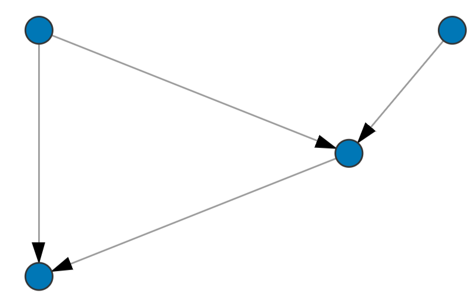

# Simple DAG visual

This is a simplistic Power BI custom visual to display a single DAG.

## Installation

To install this custom visual follow these steps:
* Install `pbiviz` (follow instructions from [tihs repo](https://github.com/microsoft/PowerBI-visuals-tools))
* Clone this repository
* Run `pbiviz package`
* In Power BI, import a visual from a file. Choose the `.pbiviz` file generated at `dist`

## Usage

To display a DAG the directed edges (src, tgt) need to be specified. Additionally a data field for nodes can be added.

## Contributing

This is a personal project and its main goal is to learn how to develop Power BI custom visuals. Nevertheless contributions are welcome.
Here is a list of next steps that I have the intention to implement:

- [] Edge data: add a variable that informs some data of the edges. It should be displayed in a box over the edges.
- [] Improve performance and modularity of the code.

## License

[MIT](https://choosealicense.com/licenses/mit/)
